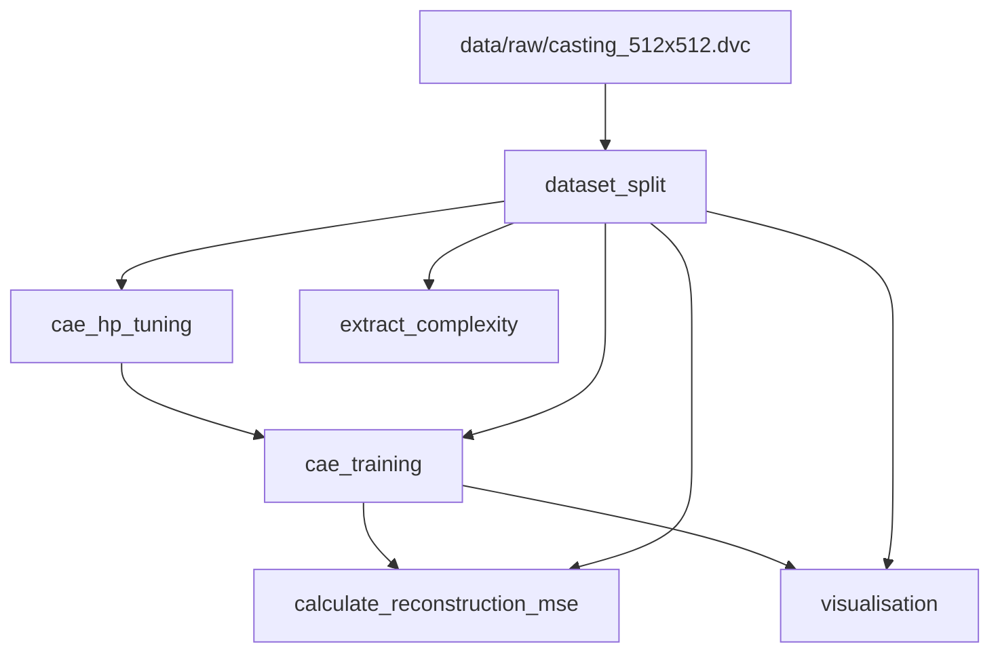

```mermaid
flowchart TD
	node1["cae_hp_tuning"]
	node2["cae_training"]
	node3["calculate_reconstruction_mse"]
	node4["data/raw/casting_512x512.dvc"]
	node5["dataset_split"]
	node6["extract_complexity"]
	node7["visualisation"]
	node1-->node2
	node2-->node3
	node2-->node7
	node4-->node5
	node5-->node1
	node5-->node2
	node5-->node3
	node5-->node6
	node5-->node7
```
