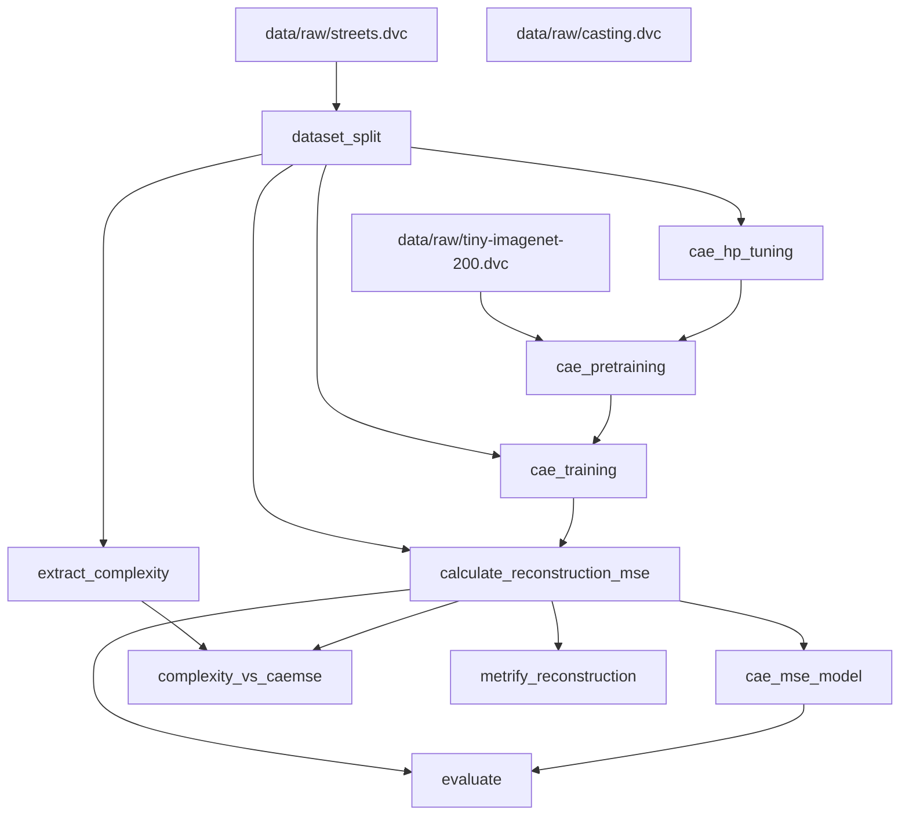

```mermaid
flowchart TD
	node1["cae_hp_tuning"]
	node2["cae_mse_model"]
	node3["cae_pretraining"]
	node4["cae_training"]
	node5["calculate_reconstruction_mse"]
	node6["complexity_vs_caemse"]
	node7["data/raw/streets.dvc"]
	node8["data/raw/tiny-imagenet-200.dvc"]
	node9["dataset_split"]
	node10["evaluate"]
	node11["extract_complexity"]
	node12["metrify_reconstruction"]
	node1-->node3
	node2-->node10
	node3-->node4
	node4-->node5
	node5-->node2
	node5-->node6
	node5-->node10
	node5-->node12
	node7-->node9
	node8-->node3
	node9-->node1
	node9-->node4
	node9-->node5
	node9-->node11
	node11-->node6
	node13["data/raw/casting.dvc"]
```
