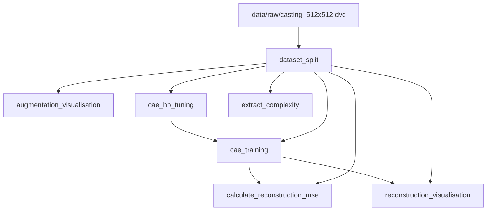

```mermaid
flowchart TD
	node1["augmentation_visualisation"]
	node2["cae_hp_tuning"]
	node3["cae_training"]
	node4["calculate_reconstruction_mse"]
	node5["data/raw/casting_512x512.dvc"]
	node6["dataset_split"]
	node7["extract_complexity"]
	node8["reconstruction_visualisation"]
	node2-->node3
	node3-->node4
	node3-->node8
	node5-->node6
	node6-->node1
	node6-->node2
	node6-->node3
	node6-->node4
	node6-->node7
	node6-->node8
```
