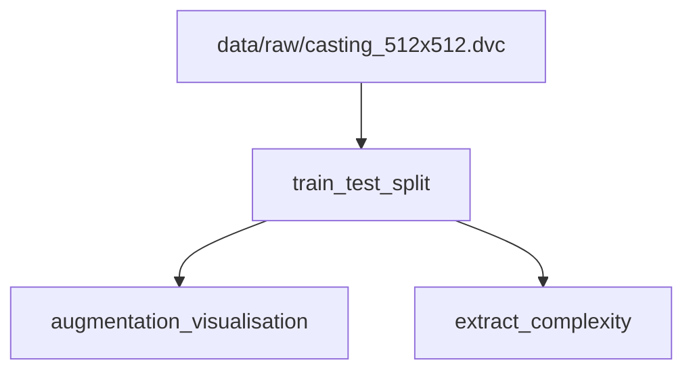

```mermaid
flowchart TD
	node1["augmentation_visualisation"]
	node2["data/raw/casting_512x512.dvc"]
	node3["extract_complexity"]
	node4["train_test_split"]
	node2-->node4
	node4-->node1
	node4-->node3
```
