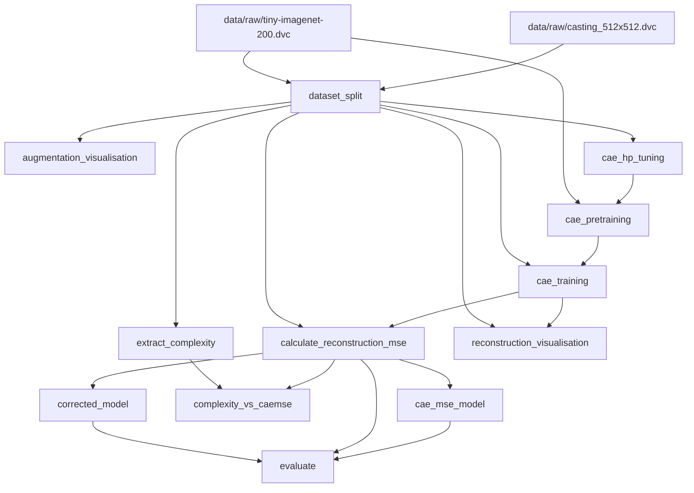

```mermaid
flowchart TD
	node1["augmentation_visualisation"]
	node2["cae_hp_tuning"]
	node3["cae_mse_model"]
	node4["cae_pretraining"]
	node5["cae_training"]
	node6["calculate_reconstruction_mse"]
	node7["complexity_vs_caemse"]
	node8["corrected_model"]
	node9["data/raw/casting_512x512.dvc"]
	node10["data/raw/tiny-imagenet-200.dvc"]
	node11["dataset_split"]
	node12["evaluate"]
	node13["extract_complexity"]
	node14["reconstruction_visualisation"]
	node2-->node4
	node3-->node12
	node4-->node5
	node5-->node6
	node5-->node14
	node6-->node3
	node6-->node7
	node6-->node8
	node6-->node12
	node8-->node12
	node9-->node11
	node10-->node4
	node10-->node11
	node11-->node1
	node11-->node2
	node11-->node5
	node11-->node6
	node11-->node13
	node11-->node14
	node13-->node7
```
