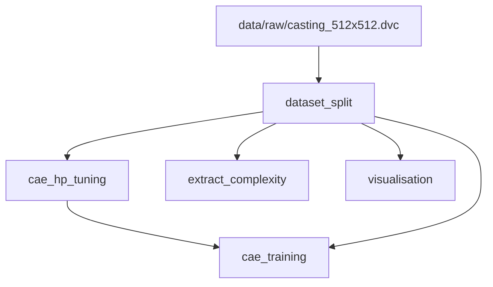

```mermaid
flowchart TD
	node1["cae_hp_tuning"]
	node2["cae_training"]
	node3["data/raw/casting_512x512.dvc"]
	node4["dataset_split"]
	node5["extract_complexity"]
	node6["visualisation"]
	node1-->node2
	node3-->node4
	node4-->node1
	node4-->node2
	node4-->node5
	node4-->node6
```
