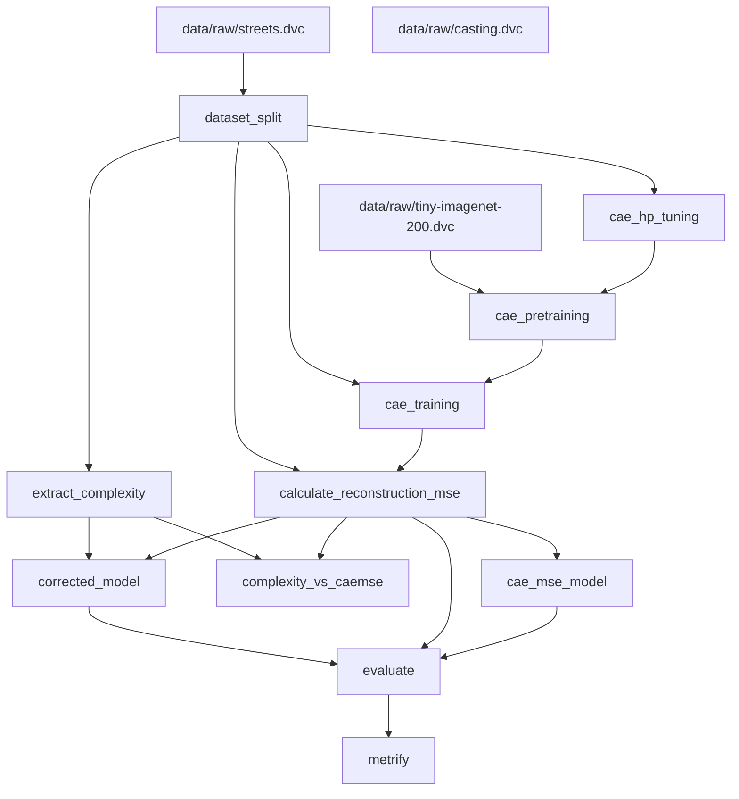

```mermaid
flowchart TD
	node1["cae_hp_tuning"]
	node2["cae_mse_model"]
	node3["cae_pretraining"]
	node4["cae_training"]
	node5["calculate_reconstruction_mse"]
	node6["complexity_vs_caemse"]
	node7["corrected_model"]
	node8["data/raw/streets.dvc"]
	node9["data/raw/tiny-imagenet-200.dvc"]
	node10["dataset_split"]
	node11["evaluate"]
	node12["extract_complexity"]
	node13["metrify"]
	node1-->node3
	node2-->node11
	node3-->node4
	node4-->node5
	node5-->node2
	node5-->node6
	node5-->node7
	node5-->node11
	node7-->node11
	node8-->node10
	node9-->node3
	node10-->node1
	node10-->node4
	node10-->node5
	node10-->node12
	node11-->node13
	node12-->node6
	node12-->node7
	node14["data/raw/casting.dvc"]
```
