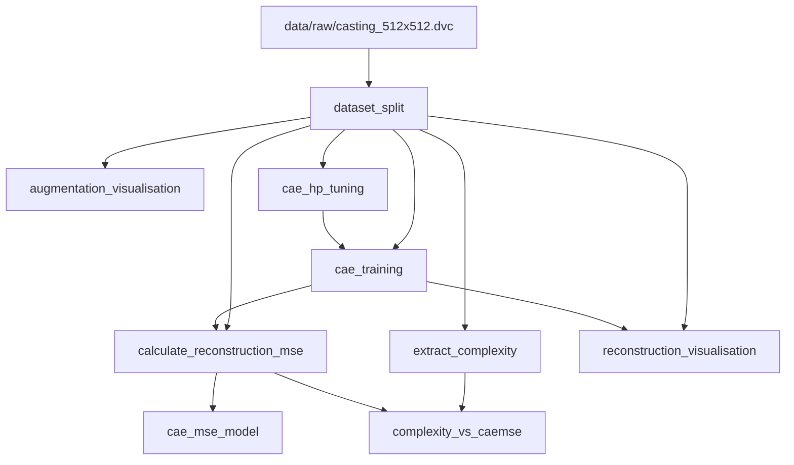

```mermaid
flowchart TD
	node1["augmentation_visualisation"]
	node2["cae_hp_tuning"]
	node3["cae_mse_model"]
	node4["cae_training"]
	node5["calculate_reconstruction_mse"]
	node6["complexity_vs_caemse"]
	node7["data/raw/casting_512x512.dvc"]
	node8["dataset_split"]
	node9["extract_complexity"]
	node10["reconstruction_visualisation"]
	node2-->node4
	node4-->node5
	node4-->node10
	node5-->node3
	node5-->node6
	node7-->node8
	node8-->node1
	node8-->node2
	node8-->node4
	node8-->node5
	node8-->node9
	node8-->node10
	node9-->node6
```
